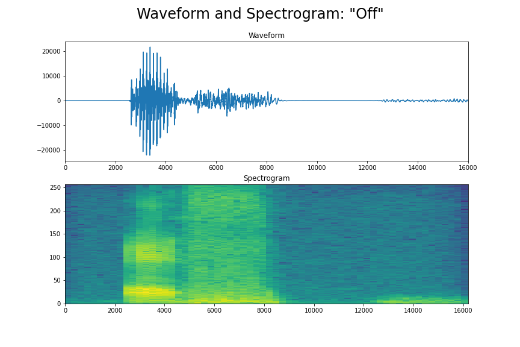

# Speech Audio Commands

___
### Kathy Simon | Data Scientist
___
# Table of Contents
| Topic | Description | Link |
| --- | --- | --- |
| Preliminary Data | Preliminary Data and EDA |[prelimary_data.ipynb](./prelimary_data.ipynb) |
| Initial EDA |EDA, visuals and dataframe created with Librosa | [initial_eda.ipynb](./initial_eda.ipynb) |
| CNN Modeling Part 1 | Model CNN MVP and Metrics | [modeling_cnn_part_1.ipynb](./modeling_cnn_part_1.ipynb)
| CNN Modeling Part 2 | Improve on CNN model, evaluate metrics and create predictions | [modeling_cnn_part_2.ipynb](./modeling_cnn_part_2.ipynb) |
| Best CNN Model | Saved Best CNN Model | [best_cnn.h5]('/.best_cnn.h5')
| Presentation Slides | Slides presented during presentation on 12/16/2021| [slides_speech_commands.pdf]('./slides_speech_commands.pdf')|
| Data | Folder Containing Data Files| [data folder](./data/) |
| Visuals | Folder Containing Visuals| [visuals folder](./visuals/)|
| Streamlit App | Scripts for Streamlit App - WORK IN PROGRESS|[streamlit_app.py]('./streamlit_app.py)|
| | | [helper.py]('./helper.py') |
| | | [/samples/off_examples.wav]('./samples/off_example.wav') |
| | | [packages.txt]('packages.txt') |
| | | [requirements.txt]('./requirement.txt') |

## Outline
___
### I. Problem Statement
### II. Background Information
### III. Description of Data 
### IV. Modeling
### V. Conclusion/Recommendation
___
### I. Problem Statement
Approximately 15% of adults report hearing loss. Video conferences, TV, streamed shows and movie theaters provide closed captions. But conversations and live events can be difficult to hear. My ultimate goal is to create a model that can provide a transcript of a live conversation. Eventually implementing an app that can provide a transcript that can be followed at a live event .

As proof of concept, I will create a model that takes audio sound and predicts speech commands from a limited vocabulary command dataset.

* Classification Model of Convolutional Neural Networks
* Metrics of success based on accuracy
___
### II. Background Information
Hearing loss affects many aspects of people’s lives. It can be difficult to communicate with friends, loved ones and coworkers. This can impact not only personal and work relationships, as well accessing services like doctors or something as simple as picking up a prescription at a pharmacy. As you can imagine, this can lead to emotional issues. Since hearing loss may contribute to social isolation and which then may contribute to dementia. Brain scans show that hearing loss may contribute to a faster rate of atrophy in the brain.

There are two types of hearing loss. The first is conductive hearing loss is when sounds cannot get through the outer and middle ear. The second is Sensorineural, which can be caused by damage to your auditory nerve or the structures of your inner ear. This type of hearing loss leads to problems converting sound vibrations to neural signals that the brain can interpret.

Although hearing aids can improve  hearing. They are not the same as wearing glasses which can restore most vision. Hearing aids will amplify all sounds. So that means that if the washing machine is running in the other room, the water running may sound like there is a waterfall in your room. Some frequencies of sound are difficult to pick up. Some people talk at such a frequency, that the hearing aids may not pick up the sounds and there can still be difficulty hearing and then communicating with the person.

There is a need for assisting in person communication beyond a hearing aid.

Cititations 
* https://www.carsonhearing.com/hearing-loss-articles/these-4-side-effects-of-hearing-loss-will-surprise-you/
* https://www.hopkinsmedicine.org/health/conditions-and-diseases/hearing-loss/types-of-hearing-loss
* https://www.fda.gov/medical-devices/hearing-aids/benefits-and-safety-issues

___
### III. Description of Data

The dataset was available on TensorFlow,  [Speech Commands: A Dataset for Limited-Vocabulary Speech Recognition. ](https://www.tensorflow.org/datasets/catalog/speech_commands). The data includes a 1 second .wav audio file from 12 classes ['down', 'go', 'left', 'no', 'off', 'on', 'right', 'stop', 'up', 'yes', '_silence_', '_unknown_'].

Citation: Warden, P., 2018. Speech commands: A dataset for limited-vocabulary speech recognition. arXiv preprint arXiv:1804.03209.

This graphic shows the waveform of an example of command. A waveform describes an audio wave by graphing how the air molecules are moved over time. The commands "left" and "_unknown_" show different labels on the x axis. Although the audio files are 1 second, some of them come in different lengths. The data will need to be padded to ensure that it is the same size.

This graphic shows an example of the command "off" in waveform and spectrogram. A spectrogram is a visual of how the frequencies of the audio vary overtime. The intensity of the audio is represented by different colors.

___
### IV. Modeling
Based on the analysis, I created a CNN model. The baseline accuracy is 63%, the training and validation accuracy is 93%. The accuracy on new data is 83%. 

This graphic shows the classification of each command. The most common misclassification is for each command is "unknown". "Down" and "go" was also misclassified as "no". "No" is misclassified as "go" and "off" is misclassified as "up". It would be interested to continuing to examine these commands to better understand the misclassifications and the correct it.

This graphic shows the predictions of an example of each command.

___
### V. Conclusion/Recommendation
The CNN model is the first step to achieve my goal to create an app that can provide a live feed transcript.

<ol><li> Further Data Exploration
<ol>a. Class imbalance of the "_unknown_" class.  
b. Add more commands to train the model on.
  </ol> 
<li> Streamlit Application
<ol>a. Fix the preprocessing issues on new audio data added to streamlit app.  
b. Record sound wave rather than uploading an audio .wav file. 
c. Add newly recorded data for the model to train on.
  </ol> 
